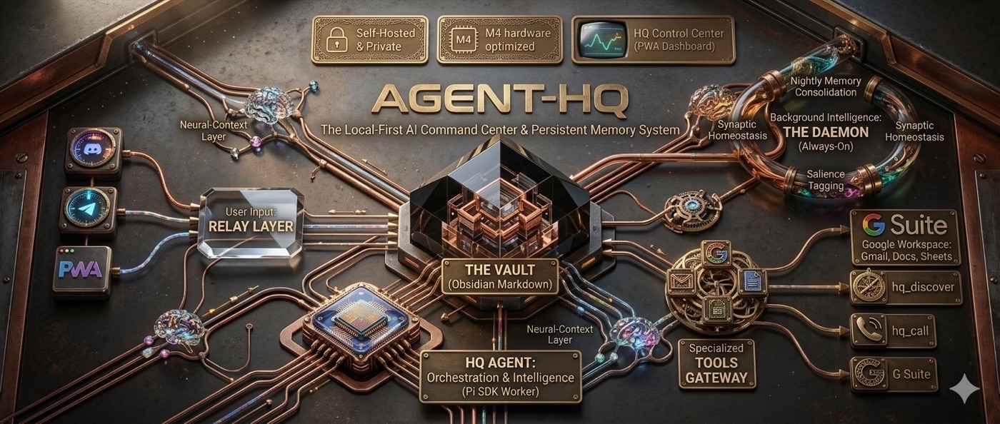
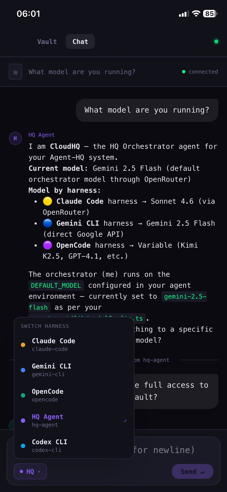
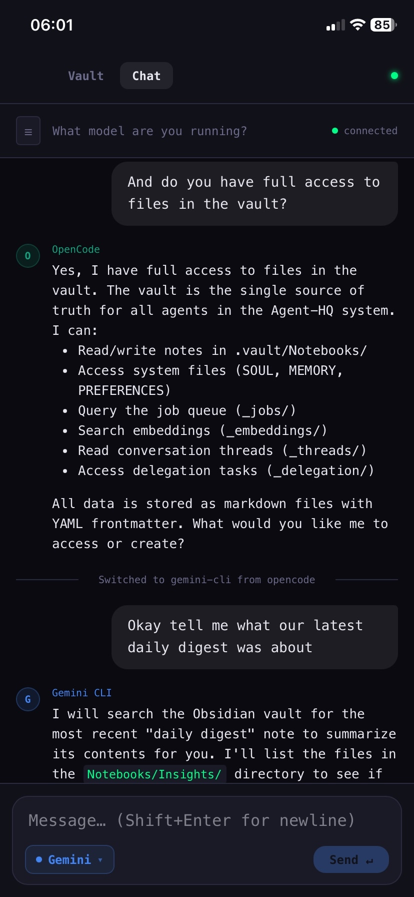
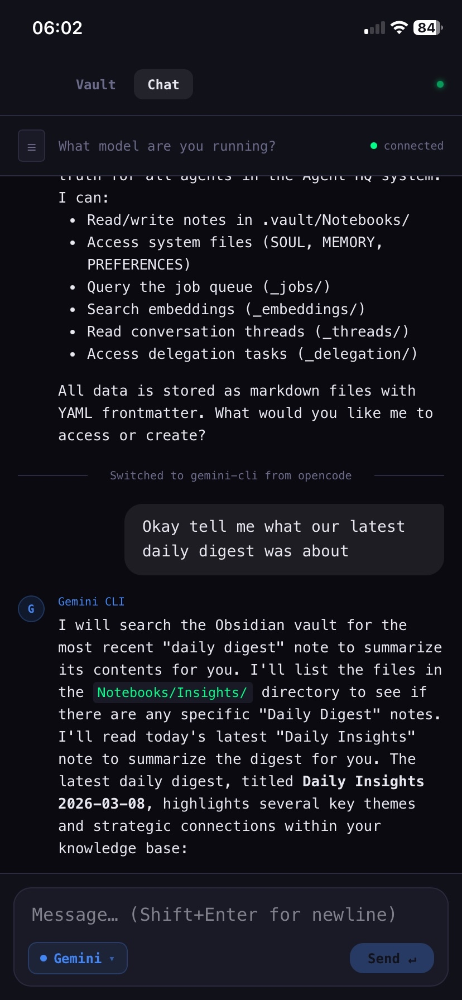

# Agent-HQ

<p align="center">
  
</p>

> **📚 Full docs and deep-dives:**
> [DeepWiki →](https://deepwiki.com/CalvinMagezi/agent-hq) · [NotebookLM →](https://notebooklm.google.com/notebook/d57fefa2-82f9-4810-82d1-a652a47ffc5f) · [Video Overview →](https://notebooklm.google.com/notebook/d57fefa2-82f9-4810-82d1-a652a47ffc5f?artifactId=fae2ad27-8c60-4051-b204-1abf3d529afa)

---

**A local-first AI orchestration hub that runs on your machine.** Agent-HQ connects Claude Code, Gemini CLI, OpenCode, and Codex CLI to every communication channel you use — Discord, Telegram, WhatsApp, a Tailscale-secured PWA — while keeping all your data in an [Obsidian](https://obsidian.md) vault on your filesystem.

No cloud backend. No vendor lock-in. Your machine, your data, your agents.

---

## See It Running

<p align="center">
  
  &nbsp;&nbsp;
  
  &nbsp;&nbsp;
  
</p>

*The HQ Control Center PWA on iPhone via Tailscale — switching between HQ Agent, OpenCode, and Gemini CLI mid-conversation. All agents share the same vault as their memory.*

---

## How It Works

```
You (PWA / Discord / Telegram / WhatsApp / Terminal)
     │
     ├── HQ Control Center PWA  ──► Tailscale-secured, installable on any device
     ├── Discord Relay          ──► Claude Code / Gemini CLI / OpenCode
     ├── Telegram Relay         ──► Voice, photos, documents, inline harness picker
     ├── WhatsApp Relay         ──► Voice, images, docs, polls, stickers
     └── Terminal Chat          ──► Streaming REPL
              │
              ▼
       Relay Server (WS + REST, port 18900)
              │
              ▼
       .vault/  ◄──────────────────────────────────────────┐
         │                                                  │
         ├── _system/   SOUL · MEMORY · CRON-SCHEDULE      │
         ├── _jobs/     atomic job queue (pending→done)     │
         ├── _delegation/  multi-agent task routing         │
         ├── _threads/  conversation history                │
         ├── _logs/     daily-briefs · scheduled-tasks      │
         └── Notebooks/ your notes · memories · projects   │
              │                                             │
              ▼                                             │
       HQ Agent (Pi SDK)  ──► Shell · Filesystem · MCP ───►│
       Daemon             ──► Embeddings · Memory · Crons ─►│
       Claude Code Scheduled Tasks  ──► Vault micro-tasks ─►│
```

The vault is the center. Every agent reads from it and writes back to it. They share the same memory, job queue, and context — so switching harnesses mid-conversation doesn't lose context.

---

## What You Get

### Core
- **Multi-harness chat** — HQ Agent, Claude (Claude Code), ChatGPT (Codex CLI), Gemini, All Models (OpenCode) — switchable per conversation
- **PWA on any device** — Install on iPhone/iPad/Android via Tailscale. Fullscreen, offline-capable, native push notifications
- **Persistent, living memory** — `vault-memory` package ingests every conversation via local Ollama (`qwen3.5:9b`), consolidates cross-harness insights every 30 min, queryable by all agents
- **Background job queue** — Queue tasks from any channel, get results back wherever you are
- **Multi-agent orchestration** — HQ delegates tasks to specialist agents with full trace logging
- **Google Workspace** — Calendar, Gmail, Drive, Sheets, Docs accessible from every agent via `gws` CLI

### Always-On Vault Health
- **Proactive notifications** — Telegram-first push when work completes (daily brief, digest ready, memory insights)
- **Daily 8 PM brief** — Summary of all daemon + micro-task activity sent to Telegram
- **Claude Code scheduled tasks** — 6 background micro-tasks that scan, prune, and report on vault health without you being present
- **Daemon workflows** — Memory consolidation, note linking, embedding, MOC generation, health checks — all local, all free

### Rich Media
- **Voice notes** — Send voice, get transcribed responses (Groq Whisper + OpenAI TTS)
- **AI vision** — Send images, get descriptions and analysis
- **Image generation** — Generate via OpenRouter, auto-sent as attachments
- **DrawIT diagrams** — Flowcharts, architecture maps, dependency graphs → PNG
- **Document processing** — PDFs, DOCX, PPTX, XLSX via agent skills

---

## Architecture

```
apps/
├── agent/                   # Local worker (Pi SDK) — job execution engine
├── discord-relay/           # Multi-bot Discord relay
├── relay-adapter-telegram/  # Telegram bot (grammY)
├── relay-adapter-whatsapp/  # WhatsApp (Baileys)
├── relay-adapter-discord/   # Discord adapter for relay server
└── hq-control-center/       # PWA (TanStack Start + Vite PWA + WebSocket)

packages/
├── vault-client/            # Shared vault data access (@repo/vault-client)
├── vault-sync/              # Event-driven file watcher + change log
├── vault-memory/            # Always-on memory: ingest → consolidate → query (Ollama)
├── vault-sync-protocol/     # E2E AES-256-GCM encryption for cross-device sync
├── vault-sync-server/       # WebSocket relay for multi-device sync
├── agent-relay-protocol/    # Types + RelayClient SDK
├── agent-relay-server/      # Bun WS+REST gateway (port 18900)
├── discord-core/            # Shared DiscordBotBase + utilities
├── hq-tools/                # 2-tool gateway: hq_discover + hq_call
├── context-engine/          # Token-budgeted context assembly
└── hq-cli/                  # NPM package

plugins/
└── obsidian-vault-sync/     # Obsidian plugin for cross-device sync

scripts/
├── hq.ts                    # Unified CLI entry point
├── agent-hq-daemon.ts       # Background workflow daemon
├── notificationService.ts   # Telegram-first push notifications
└── workflows/               # Daily/weekly scheduled scripts

~/.claude/scheduled-tasks/   # Claude Code background micro-tasks
├── vault-dead-links/        # Every 6h — scan for broken [[wikilinks]]
├── vault-orphan-notes/      # Daily 2am — find notes with no incoming links
├── vault-stale-jobs/        # Every 2h — summarize stuck jobs → HEARTBEAT.md
├── vault-memory-digest/     # Daily 6am — prune + archive MEMORY.md (Sonnet)
├── vault-soul-check/        # Mon 9am — identity drift analysis (Sonnet)
└── project-status-pulse/    # Daily 7am — per-project status summary
```

### The Vault (`_system/` files every agent reads)

| File | Purpose |
|---|---|
| `SOUL.md` | Agent identity and principles |
| `MEMORY.md` | Persistent facts and goals |
| `PREFERENCES.md` | User workflow preferences |
| `CRON-SCHEDULE.md` | Full cron schedule — any agent can answer "what runs when?" |
| `HEARTBEAT.md` | Actionable items + news pulse (updated hourly) |
| `PROJECT-PULSE.md` | Daily per-project status snapshot |
| `LINK-HEALTH.md` | Broken wikilink report |
| `ORPHAN-NOTES.md` | Notes with no incoming links |
| `SOUL-HEALTH.md` | Weekly identity drift analysis |

---

## Install

### Zero-install
```bash
bunx @calvin.magezi/agent-hq
```

### Inside the repo
```bash
git clone https://github.com/CalvinMagezi/agent-hq.git
cd agent-hq
bun install
hq init        # interactive setup — installs tools, scaffolds vault, sets up launchd
```

`hq init` installs Claude CLI, Gemini CLI, OpenCode, scaffolds `.vault/`, creates `.env.local` templates, and installs macOS launchd daemons.

---

## Prerequisites

- **[Bun](https://bun.sh)** v1.1.0+ — `curl -fsSL https://bun.sh/install | bash`
- **At least one AI CLI** — `hq tools` installs and authenticates:
  - [Claude Code](https://docs.anthropic.com/en/docs/claude-code) — requires Anthropic subscription
  - [Gemini CLI](https://github.com/google-gemini/gemini-cli) — free with Google account
  - [OpenCode](https://github.com/opencode-ai/opencode) — multi-model
  - [Codex CLI](https://github.com/openai/codex) — requires OpenAI key
- **A bot token** for whichever relay you want (Discord / Telegram / WhatsApp)

---

## Quick Start

```bash
git clone https://github.com/CalvinMagezi/agent-hq.git
cd agent-hq && bun install
hq init
```

Fill in `apps/discord-relay/.env.local` (or Telegram/WhatsApp equivalent), then:

```bash
hq start relay        # Discord
hq tg                 # Telegram (relay-server starts automatically)
hq wa                 # WhatsApp (scan QR on first run)
```

Open the PWA at `http://localhost:4747` — or connect via Tailscale from any device.

---

## Environment Variables

### Discord Relay (`apps/discord-relay/.env.local`)
```bash
DISCORD_USER_ID=your_discord_user_id
DISCORD_BOT_TOKEN=your_claude_bot_token
DISCORD_BOT_TOKEN_OPENCODE=your_opencode_token   # optional
DISCORD_BOT_TOKEN_GEMINI=your_gemini_bot_token   # optional
```

### HQ Agent (`apps/agent/.env.local`)
```bash
OPENROUTER_API_KEY=your_key    # or GEMINI_API_KEY
DEFAULT_MODEL=gemini-2.5-flash
```

### Telegram (`apps/relay-adapter-telegram/.env.local`)
```bash
TELEGRAM_BOT_TOKEN=your_botfather_token
TELEGRAM_USER_ID=your_numeric_id
GROQ_API_KEY=your_key          # voice transcription
OPENROUTER_API_KEY=your_key    # AI vision
```

### WhatsApp (`apps/relay-adapter-whatsapp/.env.local`)
```bash
WHATSAPP_OWNER_JID=your_number@s.whatsapp.net
OPENROUTER_API_KEY=your_key
GROQ_API_KEY=your_key
```

---

## The `hq` CLI

```
hq init                         First-time setup
hq tools                        Install/re-auth CLI tools
hq start  [agent|relay|all]     Start services via launchd
hq stop   [target]              Stop services
hq fg     [agent|relay]         Run in foreground
hq tg                           Start Telegram relay
hq wa                           Start WhatsApp relay (QR scan)
hq daemon start|stop|logs       Background workflow daemon
hq status                       Service status
hq health                       Full health check
hq logs   [target] [N]          View logs
hq follow [target]              Live-tail logs
hq tasks:monitor                Scheduled task health report
hq tasks:follow                 Live scheduled task dashboard
```

---

## Daemon Tasks

| Interval | Task | Notes |
|---|---|---|
| 30s | Watchdog | fs-only, zero tokens |
| 1 min | Expire stale approvals | fs-only |
| 2 min | Heartbeat + news pulse | Ollama local |
| 5 min | Health check | fs-only |
| 30 min | Memory consolidation | **Ollama `qwen3.5:9b`** — free, local |
| 30 min | Embedding processor | local embedding model |
| 1 hr | Stale job cleanup | fs-only |
| 2 hr | Note linking | embedding cosine similarity |
| 8 PM EAT | Daily brief → Telegram | summary of all tasks |

---

## Tech Stack

| Layer | Technology |
|---|---|
| Runtime | Bun |
| Data | Obsidian vault (markdown + YAML frontmatter) |
| Search | SQLite FTS5 + embedding vectors |
| Memory | Ollama `qwen3.5:9b` (local, free) |
| LLM | OpenRouter, Gemini API, Groq |
| Agent | Pi SDK |
| PWA | TanStack Start + Vite PWA + Web Push |
| Discord | discord.js v14 |
| WhatsApp | Baileys (multidevice) |
| Telegram | grammY |
| Voice | Groq Whisper (STT) + OpenAI TTS |
| Vision | OpenRouter + Gemini Flash |
| Image Gen | OpenRouter (`google/gemini-2.5-flash-image`) |
| Diagrams | @chamuka-labs/drawit-cli + resvg-js |
| Sync | Custom E2E encrypted WebSocket (AES-256-GCM) |
| Build | Turborepo + Bun workspaces |

---

## Acknowledgements

- **[Pi SDK](https://github.com/mariozechner/pi)** by [@mariozechner](https://github.com/mariozechner) — the agent execution engine
- **[claude-telegram-relay](https://github.com/godagoo/claude-telegram-relay)** by [@godagoo](https://github.com/godagoo) — inspired the CLI-harness relay pattern
- **[OpenCode](https://github.com/opencode-ai/opencode)** — inspired the multi-harness design
- **[Obsidian](https://obsidian.md)** — the vault format that is our entire database
- **[Always-On Memory Agent](https://github.com/GoogleCloudPlatform/generative-ai/tree/main/gemini/agents/always-on-memory-agent)** by Google Cloud — inspired the `vault-memory` active consolidation design

---

## Contributing

See [CONTRIBUTING.md](CONTRIBUTING.md).

## License

MIT — see [LICENSE](LICENSE).
